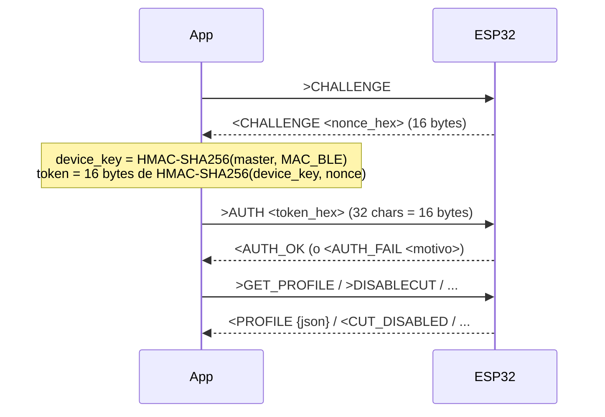

<div align="center">

# 🔐 Llave Virtual BLE

### Accesorio ESP32 + GPS — Corte de combustible controlado por Bluetooth

**Wisetrack**

<br/>


</div>

<br/>

<div align="center">


</div>

Un módulo **ESP32** actúa como accesorio del equipo **GPS (GV75CG)** para
habilitar/inhabilitar el **corte de combustible** según ignición y geocerca,
controlado desde una **app móvil** por Bluetooth. El corte y las geocercas viven
en el GPS; el ESP32 solo **decide cuándo debe estar activo el corte** y se lo
ordena al tracker por **serial** (comando AT). La app identifica el equipo por
BLE, se autentica y puede **deshabilitar** el corte.

---

## 📑 Índice

| # | Sección | # | Sección |
|---|---------|---|---------|
| 1 | [Estado actual](#-1--estado-actual) | 6 | [Comandos App → ESP32](#-6--comandos-app--esp32) |
| 2 | [Estructura del repositorio](#-2--estructura-del-repositorio) | 7 | [Respuestas ESP32 → App](#-7--respuestas--notificaciones-esp32--app) |
| 3 | [Hardware](#-3--hardware) | 8 | [Comunicación serial ESP32 ↔ GPS](#-8--comunicación-serial-esp32--gps) |
| 4 | [Lógica de corte](#-4--lógica-de-corte) | 9 | [Configuración en NVS](#-9--configuración-en-nvs) |
| 5 | [Protocolo BLE](#-5--protocolo-ble--nordic-uart-service) | 10 | [Seguridad](#-10--seguridad) |
| 5·b | [Guía de conexión para una app](#-5b--guía-de-conexión-para-una-app) | | |

---

## ✅ 1 · Estado actual

| | Ítem |
|:--:|------|
| ✅ | Prototipo (Modulo ESP32 + Conversor Serial + GPS). |
| ✅ | Compatibilidad con GPS: **GV75CG**. |
| ✅ | Firmware **V2.9**. |

---

## 🗂️ 2 · Estructura del repositorio

```
Prototipo Funcional/
├── README.md                      
├── docs/
│   ├── CONTEXTO_COWORK.md         Arquitectura y Protocolo
│   ├── INTEGRACION_BLE.md         Guía para integrar la auth BLE en una app
│   ├── README_BUILD.md            Build (Flash Encryption, etc.)
├── firmware/
│   ├── README.md                  Índice de versiones de firmware
│   ├── v1/                        Legacy (NO usar)
│   └── v2/wt_gateway_v2_serial/   ★ Firmware actual
└── tools/
    └── wt_auth.py                 Genera master y calcula tokens de auth
```

---

## 🔌 3 · Hardware

| Componente | Detalle |
|------------|---------|
| 🔧 **ESP32** | Corre el firmware `wt_gateway_v2_serial` (fw 2.9). |
| 🛰️ **GPS GV75CG** | Ejecuta el corte por su salida digital; recibe comandos AT por serial. |
| 🔀 **MAX3232** | Conversor RS-232 ↔ TTL entre ESP32 y GPS. |
| 🔋 **Fuente OKI** | DC-DC para alimentación. |

> [!IMPORTANT]
> **Serial del ESP32:** `GPIO23 = RX`, `GPIO22 = TX`.
> **Velocidad 115200 baud**
---

## ⛔ 4 · Lógica de corte

En el ESP32:

| Ignición | Geocerca | Resultado |
|:--------:|:--------:|-----------|
| OFF | Fuera | 🔴 **Corta** (bloquea) |
| ON | — | 🟢 No corta |
| OFF | Dentro | 🟢 No corta |

- El corte se ejecuta **solo al cambiar de estado de la Ignicion**.
- La app solo **deshabilita el corte** (`>DISABLECUT`).
- El estado de la ESP32 (ignición / geocerca / override / viaje / `enabled`) **persiste en NVS**.

---

## 📡 5 · Protocolo BLE — Nordic UART Service

Servicio NUS con MTU 247.

| Rol | UUID |
|-----|------|
| Servicio | `6E400001-B5A3-F393-E0A9-E50E24DCCA9E` |
| RX (App escribe) | `6E400002-B5A3-F393-E0A9-E50E24DCCA9E` |
| TX (ESP notifica) | `6E400003-B5A3-F393-E0A9-E50E24DCCA9E` |

Los comandos de la app empiezan con `>` y las respuestas del ESP con `<`. La app
escribe con **Write Request**. Las acciones sensibles exigen sesión
autenticada (`<ERR not_authed` si falta) — ver [§10 · Seguridad](#-10--seguridad).

---

## 🔗 5·b · Guía de conexión para una app

Pasos para que **cualquier app** se conecte e
interactúe con el equipo:

**1 · Escanear y filtrar.** El equipo tiene advertising anónimo (sin nombre). No
lo busques por nombre ni por UUID de servicio: fíltralo por **Manufacturer Data**
`0xFFFF` seguido de los bytes `W` `T` `0x01` (`0xFF 0xFF 0x57 0x54 0x01`).

**2 · Conectar y descubrir.** Conéctate y descubre el servicio NUS
`6E400001-…`. Toma dos características: **RX** `6E400002-…` (Write) para enviar y
**TX** `6E400003-…` (Notify) para recibir.

**3 · Suscribir notificaciones.** Activa notificaciones (CCCD) en TX **antes** de
enviar comandos, o perderás las primeras respuestas.

**4 · Formato de mensajes.** Escribe con **Write Request**. Cada comando empieza
con `>` (ej. `>PING`). Un write = un comando. Las respuestas llegan por TX
empezando con `<` y **terminan en `\n`**: acumula los bytes recibidos en un buffer
y procesa una línea cada vez que veas `\n` (una notificación ≠ un mensaje; con MTU
chico un `<PROFILE {json}` largo llega fragmentado).

**5 · Handshake de autenticación.** Los comandos de lectura (`>PING`, `>VERSION`,
`>GET_PROFILE`, `>STATUS`, `>MAC`) no requieren auth. Para los sensibles
(`>DISABLECUT`, `>ARMCUT`, `>SET_*`, `>REPORT`, etc.) primero autentícate:



> [!IMPORTANT]
> La sesión autenticada **se pierde al desconectar** (`g_authed=false`). Hay que
> repetir el handshake en cada reconexión. El **estado del corte NO se revierte**
> al desconectar.

**6 · Parsear el estado.** `>GET_PROFILE` → `<PROFILE {json}` con la config +
estado completos (`type:"profile"`). `>STATUS` → `<STATUS name=… en=… ign=… geo=…
cut=… override=…` (clave=valor, no JSON). El latido periódico KA
(`mac|name|enabled`) NO viaja por BLE: sale por serial al GPS; solo es visible por
BLE en el monitor admin con `>SERMON 1` (llega como eco `<TXGPS AT+GTDAT=…`).

> [!TIP]
> Para probar sin escribir código: **nRF Connect** o **Serial Bluetooth Terminal**
> hablan NUS directo. Los comandos de lectura funcionan sin auth; para los
> sensibles hay que calcular el HMAC a mano con el nonce de `<CHALLENGE`.

---

## 📤 6 · Comandos App → ESP32

<details open>
<summary><b>Productivos — sin auth previa</b></summary>

| Comando | Función |
|---------|---------|
| `>PING` | Ping de conectividad → `<PONG`. |
| `>VERSION` | Versión de firmware y MAC. |
| `>GET_PROFILE` | Configuración + estado en vivo (JSON). |
| `>STATUS` | Estado resumido. |
| `>MAC` | MAC BLE del equipo. |
| `>NAME [txt]` | Lee (`>NAME`) o fija (`>NAME xxx`) el nombre interno. |
| `>SERSTATS` | Estadísticas del bus serial (bytes RX, líneas). |
| `>SERMON <0\|1>` | Activa/desactiva el monitor serial por BLE. |
| `>PROVISION <hex64>` | Provisiona: deriva la `device_key` desde el master. |
| `>CHALLENGE` | Solicita nonce para autenticarse. |
| `>AUTH <hex32>` | Envía el token calculado sobre el nonce. |

</details>

<details open>
<summary><b>Productivos — exigen auth</b> 🔒</summary>

| Comando | Función |
|---------|---------|
| `>DISABLECUT` | Deshabilita el corte (acción principal de la app). |
| `>ARMCUT` | Re-arma el corte (solo Admin). |
| `>REPORT` | Empuja el `profile` completo a Wisetrack por GTDAT (bajo pedido). |
| `>UNPROVISION` | Borra la `device_key` (vuelve a estado sin provisionar). |
| `>AUTO_DETECT` | Lanza la detección de perfil del tracker. |
| `>SET_PROFILE <p>` | Fija el perfil (p. ej. `gv75cg`). |
| `>SET_CUTON <at>` / `>SET_CUTOFF <at>` | Comandos AT de corte on/off. |
| `>SET_IGNON <s>` / `>SET_IGNOFF <s>` | Tokens serial de ignición. |
| `>SET_GEOIN <s>` / `>SET_GEOOUT <s>` | Tokens serial de geocerca. |
| `>SET_KA <s>` | Intervalo del latido KA (segundos). |

</details>

<details>
<summary><b>Debug / Banco de pruebas</b> 🧪 <i>(solo si se compila con <code>WT_DEBUG</code>; en la build productiva NO existen)</i></summary>

| Comando | Función |
|---------|---------|
| `>TESTGPS ON\|OFF` | Modo prueba de GPS. |
| `>SIM <token>` | Inyecta un token serial simulado (IGN/geocerca/etc.). |
| `>DUMP` | Vuelca el estado completo (sondeado por el bench). |
| `>SETIGN` / `>SETGEO` / `>SETGEOKNOWN` / `>SETOVR` | Fija estados manualmente. |
| `>SETEN` | Fija el flag `enabled` (standby). |
| `>RELAXGEO` / `>ALWAYSSEND` / `>IGNOVR` | Flags de "modo libre". |

</details>

---

## 📥 7 · Respuestas / notificaciones ESP32 → App

| Mensaje | Significado |
|---------|-------------|
| `<PONG` | Respuesta a `>PING`. |
| `<VERSION fw=2.9 mac=…` | Versión y MAC. |
| `<PROFILE {json}` | Configuración + estado (respuesta a `>GET_PROFILE`). |
| `<PROFILE_DETECTED <name>` | Perfil detectado por AUTO_DETECT. |
| `<AUTO_DETECT start\|none` | Progreso/resultado de la detección. |
| `<STATUS name=… en=…` | Estado resumido. |
| `<DUMP …` | Estado completo (no se loguea; frecuente por el sondeo). |
| `<CHALLENGE <nonce>` | Nonce para autenticación. |
| `<AUTH_OK` / `<AUTH_FAIL <motivo>` | Resultado de auth (`no_key`, `no_challenge`, `bad_format`, `wrong_token`, `internal_error`). |
| `<PROVISION_OK mac=…` / `<UNPROVISION_OK` | Provisioning. |
| `<CUT_DISABLED` / `<CUT_ARMED` | Corte deshabilitado / re-armado. |
| `<TXGPS <cmd>` | Eco del comando AT enviado al GPS. |
| `<NAME …` / `<OK …` | Confirmaciones de setters. |
| `<SER …` / `<SERHEX …` | Líneas del bus serial (si SERMON activo). |
| `<ERR <motivo>` | Error: `not_authed`, `device_disabled`, `unknown_cmd`, `bad_name`, `no_key_set`, `already_provisioned`, `bad_master_format`, `derivation_failed`, `no_profiles`. |

---

## 🔁 8 · Comunicación serial ESP32 ↔ GPS

Desde el GPS **solo** se aceptan dos tipos de entrada; cualquier otra cosa
(incluidos comandos `>`) se ignora en silencio.

**a) Tokens de estado** (configurables) que disparan la lógica de corte:

| Token (default) | Evento |
|-----------------|--------|
| `IGN_ON` / `IGN_OFF` | Ignición encendida / apagada. |
| `ZonaSegura_ON` / `ZonaSegura_OFF` | Dentro / fuera de geocerca. |

**b) Config remota** `clave|valor` (la plataforma la manda con `AT+GTDAT` **tipo 1**,
que el GV75CG saca por su serial). Persiste en NVS:

| Clave | Parámetro | Ejemplo |
|:--:|-----------|---------|
| `1` | nombre interno (`<24`) | `1|PWWS63` |
| `2` | intervalo del latido KA (seg) | `2|3600` → 1 h |
| `3` | operativo / standby (`1`/`0`) | `3|0` |
| `4` | perfil del tracker | `4|gv75cg` |

**El ESP envía al GPS:**

- ⛔ **Corte:** `cmd_cut_on` / `cmd_cut_off` (AT, por defecto `AT+GTDOS=gv75cg,…`).
- 💓 **Latido KA:** salud envuelta en `AT+GTDAT=gv75cg,2,,<payload>,0,,,,FFFF$` para
  que el GPS la reenvíe a plataforma. Intervalo único `ka` (def. 60 s). Payload
  **sin JSON**, separador `|` y MAC sin `:`:
  `mac|name|enabled` (ej. `AABBCCDDEEFF|WT-EEFF|1`). El `|` y la MAC sin `:` evitan
  chocar con las comas del campo Data del GTDAT.
- 📋 **Profile bajo pedido:** con `>REPORT` (BLE) se empuja el JSON completo
  (`type:"profile"`) por el mismo GTDAT. ⚠️ Ese JSON **sí lleva comas** → validar
  contra el manual @Track del GV75CG (puede requerir payload sin comas).

---

## 💾 9 · Configuración en NVS

Todos los parámetros de operación viven en NVS con valores por
defecto (`DEF_*`) que solo aplican al primer arranque; luego se editan en runtime
con los setters `>SET_*` o desde la app.

> Parámetros: `baud`, `profile`, `cmd_cut_on/off`, tokens de
> ignición/geocerca, intervalo `ka`, `enabled`, `name`.

---

## 🛡️ 10 · Seguridad

- 🕵️ **Advertising anónimo:** no difunde nombre ni datos identificables; solo la
  app lo reconoce por Manufacturer Data `0xFFFF`+`W`+`T`+`0x01`. Un scanner
  genérico lo ve como "Unknown Device". La patente **no** viaja en claro.
- 🔑 **Autenticación BLE challenge-response:**
  `device_key = HMAC-SHA256(master, MAC)`; token = primeros 16 bytes de
  `HMAC-SHA256(device_key, nonce)`. Sin auth, las acciones se rechazan.
- 🚧 **Dispatcher por canal:** por serial solo se atiende una whitelist
  (`GET_PROFILE`, `STATUS`, `VERSION`); el resto se ignora en silencio.
- 🔒 **Flash Encryption (Pendiente):** (irreversible; ver `docs/README_BUILD.md`).

### 🔑 Generar la clave (master) e integrar la auth

El **master no vive en el repo**: se genera y se entrega fuera de banda al equipo
de desarrollo. Con él, la app puede descubrir y comandar **cualquier ESP32 con
este firmware** (leer no requiere master; comandar sí).

```bash
# 1. Generar el master (una vez; compártelo por canal privado, NO lo subas a git)
python3 tools/wt_auth.py gen-master
#    -> 64 hex chars (32 bytes)

# 2. Provisionar un equipo (una vez por ESP): por BLE
#    >PROVISION <master_hex_64>   ->  <PROVISION_OK

# 3. Autenticar en cada conexión:
#    >CHALLENGE            -> <CHALLENGE <nonce_hex>   (8 bytes)
#    calcular el token y enviarlo:
python3 tools/wt_auth.py token --master <hex> --mac AA:BB:CC:DD:EE:FF --nonce <nonce>
#    >AUTH <token_hex_32>  ->  <AUTH_OK
```

Derivación (lo que la app debe implementar):
`device_key = HMAC-SHA256(master, MAC_6bytes)` · `token = HMAC-SHA256(device_key, nonce)[:16]`.
La MAC es la que viaja en el advertising. Guía completa e integración:
[`docs/INTEGRACION_BLE.md`](docs/INTEGRACION_BLE.md).
